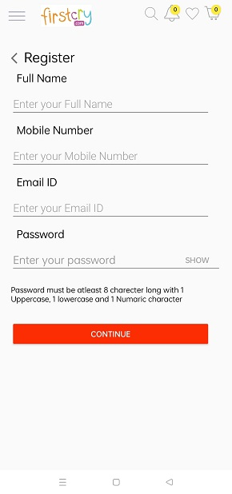
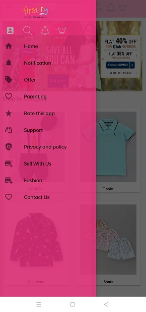
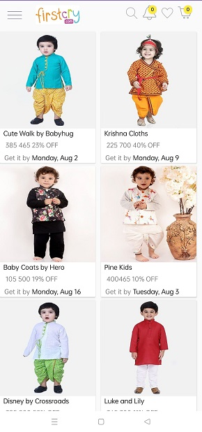
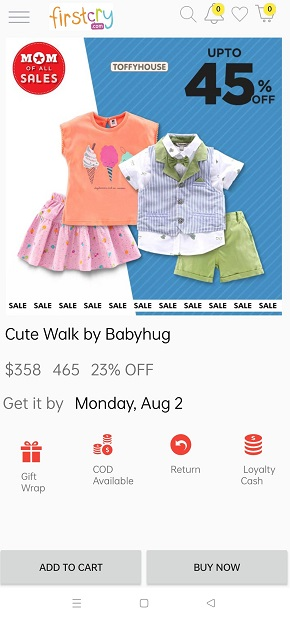
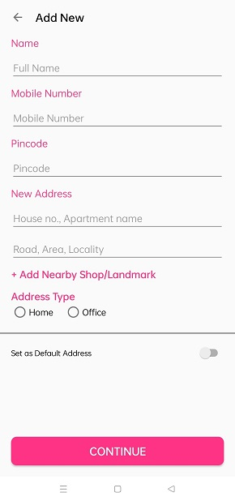

# First-Cry
 India's Largest Online Store for newborn, baby &amp; kids products.
 
 Blog inspired from this project.
 
 [Learning from Project](https://kingbond470.hashnode.dev/i-wanted-to-become-a-programmer-but-fail-what-i-learned-or-a-story-of-learning-android-development)
 
 Landing Page
 
                               
 
 
 <table>
  <tr>
    <td>Register User</td>
     <td>Login User</td>
  </tr>
  <tr>
    <td></td>
    <td></td>
  </tr>
 </table>

 
 Home - Menu bar
 
 
 
 
 <table>
  <tr>
    <td>Order Cart</td>
     <td>Notification</td>
     <td>Wishlist/Favourite</td>
  </tr>
  <tr>
    <td></td>
    <td></td>
    <td></td>
  </tr>
 </table>
 

 Item List
 
  <table>
  <tr>
    <td>Item List 1</td>
   <td>Item List 2</td>
  </tr>
  <tr>
    <td></td>
    <td></td>
  </tr>
 </table>

 
 Item Details
 
 
 
 Payment Details
 
 
