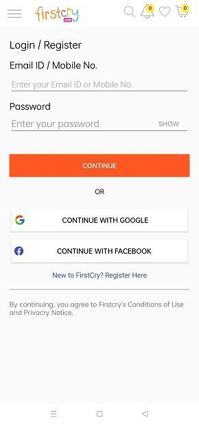
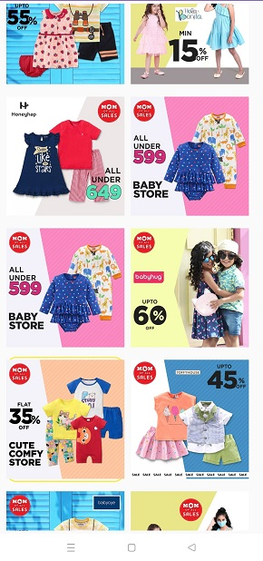

# First-Cry
 
 ## Clone of First Cry Android Application

This is a clone of First Cry Android Application which is a India's Largest Online Store for newborn, baby &amp; kids products.

### Building the Sample App

First, clone the repo:
You can use any one of the way to do it.

1. HTTPS

        git clone https://github.com/Kingbond470/First-Cry.git

2. SSH

       git clone git@github.com:Kingbond470/First-Cry.git

3. GitHub CLI

       gh repo clone Kingbond470/First-Cry

Android Studio

    Open Android Studio and select File->Open... or from the Android Launcher select Import project (Eclipse ADT, Gradle, etc.) and navigate to the root directory of your project.
    Select the directory or drill in and select the file build.gradle in the cloned repo.
    Click 'OK' to open the the project in Android Studio.
    A Gradle sync should start, but you can force a sync and build the 'app' module as needed.

Gradle (command line)

    Build the APK: ./gradlew build

Running the Sample App

Connect an Android device to your development machine.
Android Studio

    Select Run -> Run 'app' (or Debug 'app') from the menu bar
    Select the device you wish to run the app on and click 'OK'

Gradle

    Install the debug APK on your device ./gradlew installDebug
    Start the APK: 
 
 Splash Screen
 
 
 
 Landing Page
 
                               
 
 
 <table>
  <tr>
    <td>Register User</td>
     <td>Login User</td>
  </tr>
  <tr>
    <td></td>
    <td></td>
  </tr>
 </table>

 Home - Dashboard
 
 

 
 Home - Menu bar
 
 
 
 Fashion Page
 
 
 
 
 <table>
  <tr>
    <td>Order Cart</td>
     <td>Notification</td>
     <td>Wishlist/Favourite</td>
  </tr>
  <tr>
    <td></td>
    <td></td>
    <td></td>
  </tr>
 </table>
 

 Item List
 
  <table>
  <tr>
    <td>Item List 1</td>
   <td>Item List 2</td>
  </tr>
  <tr>
    <td></td>
    <td></td>
  </tr>
 </table>

 
 Item Details
 
 
 
 Payment Details
 
 
 
 Parenting Dashboard
 
 

 
 Contact Us page
 
  

Technologies

    Java
    Glide
    Recycler View
    Fragments
    Scroll View
    Navigation Drawer
    Shared Preferences
    XML
    Firebase
    TabLayout
    ViewPager
    
    
    
  ## [Contributors](#Contributors)

- [Mausam Singh](https://github.com/Kingbond470)
- [Abhishek Kumar](https://github.com/Abhishekvlog)
- [Barshed](https://github.com/Barshed8974)

 
 Blog related to Project
 
 [Learning from Project](https://kingbond470.hashnode.dev/i-wanted-to-become-a-programmer-but-fail-what-i-learned-or-a-story-of-learning-android-development)
